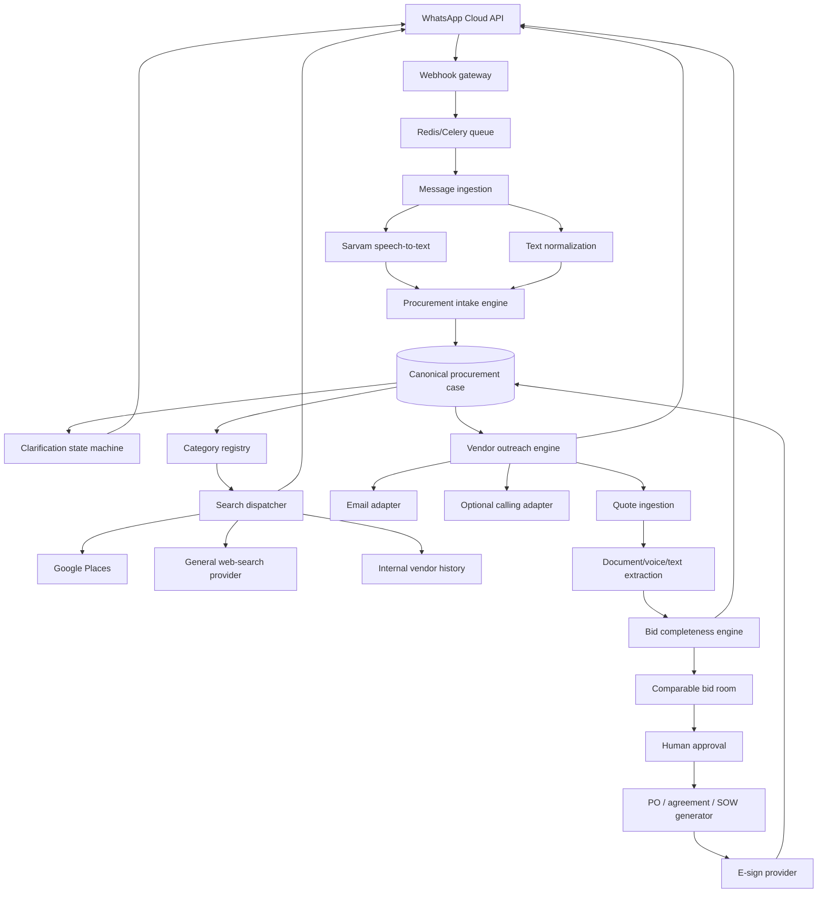

# Boli — Complete Implementation Plan

## 1. Product definition

Boli is a WhatsApp-first procurement agent for SMBs. A buyer describes a product, recurring service, or project in their own language. Boli maintains a canonical procurement case, finds potential vendors, gathers and completes quotations, normalizes commercial terms, and prepares a purchase order, service agreement, or statement of work for authorised human approval.

The product is horizontal at the interface and modular underneath:

- One WhatsApp number accepts broad business needs.
- A request classifier determines procurement type and category.
- A category pack supplies domain-specific questions, qualification rules, quote fields, risk flags, and document templates.
- Unsupported categories degrade honestly to research and organization rather than fabricated expertise.

## 2. Scope strategy

### Product vision

Support arbitrary companies, locations, products, and services.

### Build strategy

Implement the universal pipeline first, then add category packs. Do not make every category a first-class autonomous workflow at launch.

### Support tiers

#### Fully supported

Boli can ask category-specific questions, determine bid completeness, normalize quotes, identify category risks, and create a suitable commercial document.

#### Partially supported

Boli can structure the request, discover vendors, collect responses, extract generic terms, and let the buyer define comparison criteria.

#### Research-only

Boli finds and organizes vendors but does not recommend, negotiate, or draft final commercial terms without expert or buyer review.

## 3. User journeys

### 3.1 Local-service search

1. Buyer sends a WhatsApp voice note.
2. Boli transcribes it and extracts the need, area, budget, deadline, and constraints.
3. Boli asks one missing question.
4. Buyer replies.
5. Boli searches local vendor sources.
6. Boli returns a numbered shortlist in WhatsApp.
7. Buyer selects vendors for RFQ outreach.

### 3.2 Product supplier search

1. Buyer describes the item, quantity, specifications, delivery location, and deadline.
2. Boli identifies missing specification fields.
3. Boli searches national or regional suppliers using the appropriate provider.
4. Boli presents suppliers and asks the buyer which should receive the RFQ.
5. Later, quotations are normalized by unit price, MOQ, tax, freight, sample cost, and lead time.

### 3.3 Recurring-service contract

1. Buyer describes locations, frequency, coverage, service windows, SLAs, and compliance requirements.
2. Boli collects complete bids.
3. Buyer compares effective annual cost and exclusions.
4. Boli prepares a service agreement.
5. An authorised human approves and signs.

## 4. Architecture



## 5. Technical stack

### Current scaffold

- Python 3.11+
- FastAPI
- SQLModel / SQLAlchemy
- PostgreSQL
- Redis and Celery
- Meta WhatsApp Cloud API
- Sarvam Saaras v3 for speech-to-text
- Sarvam chat structured outputs for requirement extraction
- Google Places Text Search (New)
- Docker Compose

### Later components

- Object storage for vendor documents and voice notes.
- Alembic migrations.
- React/Vite internal procurement room.
- OpenTelemetry and error tracking.
- E-sign integration.
- Email and optional telephony adapters.
- A general web-search provider for non-local suppliers.

## 6. Domain model

### Conversation

Represents a WhatsApp identity and language preference.

### CompanyProfile

- Legal and trade names.
- GST and billing details.
- Locations.
- Procurement rules.
- Approval thresholds.
- Standard payment terms.
- Maximum advance payment.
- Preferred and blocked vendors.
- Authorised approvers.

### ProcurementCase

- Raw buyer request.
- Procurement type.
- Category.
- Canonical specification.
- Location and delivery/service radius.
- Quantity.
- Budget.
- Deadline.
- Mandatory and preferred criteria.
- Support tier.
- Current state.
- Buyer approval state.

### RequirementField

Each canonical field should eventually contain:

- Field name.
- Value.
- Source message/document.
- Source timestamp/page/segment.
- Confidence.
- Status: sourced, inferred, missing, contradicted, or buyer-confirmed.

### Vendor

Persist only independently obtained or vendor-confirmed data as durable business records. External discovery IDs remain references to source systems.

### VendorCandidate

A transient discovery result attached to a search run. It expires according to source-provider policy unless converted into a consented vendor lead.

### RFQ

- Versioned specification.
- Buyer confirmation.
- Recipients.
- Response deadline.
- Delivery channels.
- Category-specific questions.

### VendorResponse

- Raw voice, text, PDF, or image.
- Extracted commercial fields.
- Evidence references.
- Missing and conflicting fields.
- Follow-up history.

### Bid

A completed, normalized commercial response with effective cost and category-specific risk flags.

### Approval

An explicit action by an authorised buyer, with timestamp, scope, and exact terms approved.

### CommercialDocument

PO, service agreement, or statement of work generated from the approved case and template version.

## 7. State machines

### 7.1 Procurement case

```text
new
 -> needs_clarification
 -> ready_to_search
 -> searching
 -> shortlist_ready
 -> awaiting_buyer_shortlist
 -> rfq_ready
 -> outreach_in_progress
 -> collecting_responses
 -> completing_bids
 -> comparison_ready
 -> awaiting_approval
 -> document_ready
 -> awaiting_signature
 -> contracted
```

Failure and terminal states:

```text
failed
cancelled
expired
closed
```

### 7.2 Vendor response

```text
not_contacted
queued
sent
delivered
responded
incomplete
followup_sent
complete
declined
expired
```

### 7.3 Commercial authority

The agent may:

- Search.
- Ask questions.
- Draft.
- Compare.
- Explain.
- Request confirmation.

The agent may not without explicit human authority:

- Commit spend.
- Accept legal terms.
- Sign.
- Make an irreversible concession.
- Represent a vendor as verified.
- Send cold outreach outside configured consent and messaging rules.

## 8. Category-pack contract

Each category pack should be a versioned configuration plus code hooks:

```yaml
id: pest_control
version: 1
procurement_type: recurring_service
support_tier: fully_supported
required_fields:
  - service_locations
  - frequency
  - pests_covered
  - service_window
  - emergency_support
  - gst_required
comparison_fields:
  - annual_effective_cost
  - scheduled_visits
  - emergency_visits
  - response_sla
  - chemical_certification
risk_rules:
  - cheapest_bid_excludes_required_coverage
  - price_excludes_tax
  - no_termination_clause
output_document: service_agreement
```

### Category-pack runtime responsibilities

- Classify whether the pack applies.
- Generate missing-field questions.
- Generate a canonical RFQ.
- Parse bid fields.
- Calculate comparable commercial values.
- Detect contradictions.
- Flag, not hide, assumptions.
- Generate document variables.

## 9. Search architecture

### 9.1 User interface

All search commands originate in WhatsApp. The buyer does not need a search dashboard.

Examples:

- “Find commercial pest-control companies near all three outlets.”
- “Search packaging suppliers across India who can deliver 10,000 boxes to Jaipur.”
- “Only show vendors who can provide a GST invoice.”
- “Widen the search to 50 km.”
- “Remove vendor 2 and find two alternatives.”

### 9.2 Search dispatcher

Classify each search as:

- Hyperlocal service.
- Regional service.
- Shippable product.
- Remote professional service.
- Project contractor.

Select providers accordingly.

### 9.3 Providers

#### Google Places

Use for current local-business discovery. Request only necessary fields with a field mask. Treat returned content as transient and follow attribution and storage rules.

#### General web search

Use for supplier websites, national manufacturers, trade associations, and non-geospatial vendors. Add a provider interface rather than coupling the product to one search API.

#### Internal vendor memory

Use buyer history and platform performance data, clearly distinguished from open-web discovery.

#### Buyer contacts

Allow a buyer to include known vendors from their phone, spreadsheet, accounting system, or previous cases.

### 9.4 Search ranking

Initial ranking may use:

- Location eligibility.
- Category match.
- Business status.
- Contactability.
- Buyer history.
- Required-document availability.
- Response history.

Do not rank a vendor as “best” solely from public ratings.

### 9.5 Search output in WhatsApp

Return five candidates at a time with:

- Name.
- Area.
- Public contact information when permitted.
- Source link.
- Why it matched.
- What remains unverified.

The buyer replies with numbers, adds constraints, or asks for alternatives.

## 10. Voice and multilingual behaviour

### Input

- WhatsApp voice notes.
- Hindi, English, and code-mixed speech first.
- Preserve proper nouns, numbers, units, addresses, and deadlines.
- Use Sarvam `codemix` mode for user-friendly mixed-script output.

### Clarification policy

- Ask one question at a time.
- Ask the highest-information missing question.
- Repeat critical numbers and names for confirmation.
- Never silently normalize ambiguous amounts, dates, or measurements.

### Output

The MVP responds in text. Later, optionally return a concise voice note using Sarvam TTS while retaining text as an auditable record.

## 11. Milestones

## Milestone 0 — Foundation and scope lock

### Build tasks

- Create repository and environment configuration.
- Add Docker Compose.
- Define core data model.
- Document human-authority boundary.
- Define first two category packs for testing.

### Acceptance test

The service boots locally, `/health` responds, and tests run without external credentials.

### If behind, cut to

SQLite, inline processing, and mock search.

### Status

Implemented in the supplied scaffold.

---

## Milestone 1 — WhatsApp search vertical slice

### Build tasks

- Configure Meta webhook verification.
- Verify webhook signatures.
- Deduplicate inbound messages.
- Receive text and voice notes.
- Download media.
- Transcribe with Sarvam.
- Extract a structured requirement.
- Persist the procurement case.
- Ask one clarification.
- Search Google Places.
- Return a numbered shortlist in WhatsApp.

### Acceptance test

Three messages produce correct behaviour:

1. Complete text request returns a shortlist.
2. Incomplete text request asks for location, then searches after the reply.
3. Hindi/Hinglish voice note produces a correct search query and shortlist.

### If behind, cut to

Text only, mock search, inline processing.

### Status

Implemented in code. Real Meta/Sarvam/Google credentials remain to be connected and verified.

---

## Milestone 2 — Search refinement and shortlist selection

### Build tasks

- Persist transient search references with expiry.
- Support replies such as `1, 3, 4`.
- Support commands: `more`, `widen`, `change city`, `exclude`, `new search`.
- Confirm selected candidates.
- Convert selected candidates into vendor leads only after buyer action.
- Add search-source and uncertainty labels.

### Acceptance test

The buyer can refine a search over three turns and finish with exactly three selected vendors.

### If behind, cut to

One numbered selection and no multi-command parser.

### Data-policy gate

Verify provider-specific caching, attribution, and display requirements before persisting any provider content.

### Status

Partially implemented. Numbered selection (`1, 3, 4`), `new search`, shortlist
confirmation, transient candidate persistence with expiry, and source/uncertainty
labels are done. The `more`, `widen`, `change city`, and `exclude` refinement
commands are deferred to a later refinement milestone.

---

## Milestone 3 — Company profile and procurement memory

### Build tasks

- Add company profile onboarding through WhatsApp.
- Store locations, GST preference, standard payment terms, advance limit, and approvers.
- Apply policies to new cases.
- Let the user correct and forget stored values.
- Add a WhatsApp `show my rules` command.

### Acceptance test

A returning buyer starts a new request and Boli correctly reuses locations and commercial rules, while asking confirmation before applying sensitive terms.

### If behind, cut to

One company, locations, GST rule, and approver only.

---

## Milestone 4 — RFQ generation and controlled outreach

### Build tasks

- Create a versioned RFQ from the canonical case.
- Show the RFQ to the buyer for confirmation.
- Add vendor-contact queue.
- Support vendor outreach through WhatsApp and email.
- Enforce channel rules and approved templates where required.
- Track delivery and response status.
- Provide opt-out and suppression controls.

### Acceptance test

The buyer approves an RFQ and three pre-consented test vendors receive the same requirement with a response deadline.

### If behind, cut to

Generate RFQ text and manually copy it to vendors.

### Safety gate

Do not enable autonomous cold outreach until messaging consent, template, rate, and anti-spam controls are reviewed.

### Status

Implemented. Versioned RFQ generation, buyer confirmation, the
outreach-approval gate, a vendor-contact queue with consent/suppression/rate
controls, WhatsApp sends to consented vendors, and per-vendor
send/delivery status tracking are done. Mock/test vendors are pre-consented;
discovered (cold) vendors default to `contact_consent=false` and are skipped
until the buyer grants consent. Email outreach is a stub interface (real SMTP is
a later addition). Inbound vendor-response *content* ingestion is Milestone 5.

---

## Milestone 5 — Multi-format quotation ingestion

### Build tasks

- Receive vendor text, voice, PDF, and image responses.
- Link responses to the correct case and vendor.
- Store source documents securely.
- Extract generic commercial fields.
- Retain page/timestamp evidence.
- Mark sourced, inferred, missing, and contradicted fields.

### Acceptance test

One text response, one voice note, and one PDF appear in the same canonical bid schema without losing source references.

### If behind, cut to

Text and PDF only.

---

## Milestone 6 — Bid completeness engine

### Build tasks

- Implement category-pack required fields.
- Calculate bid completeness.
- Generate vendor follow-up questions.
- Send one follow-up at a time.
- Stop after response, deadline, decline, or buyer cancellation.
- Prevent inferred values from being treated as confirmed terms.

### Acceptance test

Three incomplete quotations become comparable bids or are clearly marked incomplete after the follow-up deadline.

### If behind, cut to

Display missing fields and let the buyer manually request clarification.

---

## Milestone 7 — Comparable bid room

### Build tasks

- Build internal React view.
- Compare category-specific fields.
- Compute effective cost with explicit formulas.
- Show exclusions and risk flags.
- Link each value to evidence.
- Produce a recommendation only when mandatory fields are complete.
- Allow buyer weights without presenting false precision.

### Acceptance test

The system identifies a hidden exclusion in the cheapest bid and explains why another bid may be better value.

### If behind, cut to

WhatsApp summary plus downloadable comparison table.

---

## Milestone 8 — Approval and document generation

### Build tasks

- Add approver identity and authority checks.
- Record the exact bid version approved.
- Generate PO, service agreement, or SOW from a reviewed template.
- Highlight non-standard terms.
- Require human confirmation.
- Produce a PDF or DOCX and audit record.

### Acceptance test

An authorised user selects a vendor and receives a document whose scope, price, tax, schedule, and exclusions exactly match the approved bid.

### If behind, cut to

Editable DOCX draft with no e-sign.

### Legal boundary

The system drafts and routes. Humans approve and sign. High-value or unusual terms should be escalated for legal review.

---

## Milestone 9 — E-sign and contract state

### Build tasks

- Integrate a supported e-sign provider.
- Route signers.
- Track signed, declined, and expired states.
- Store audit evidence and final document.
- Notify both parties in WhatsApp.

### Acceptance test

A sandbox agreement completes signature and the procurement case moves to `contracted` only after the provider confirms completion.

### If behind, cut to

Generate signing links manually.

---

## Milestone 10 — Performance, invoice, and renewal loop

### Build tasks

- Track service visits, delivery, issues, and buyer feedback.
- Compare invoices with agreed terms.
- Alert on missing visits, price drift, and exclusions.
- Trigger renewal or re-bid workflows.
- Add vendor performance memory.

### Acceptance test

A renewal request uses previous price, SLA, complaints, and buyer decision reasons without repeating the original discovery work.

### If behind, cut to

Renewal reminders and manual performance notes.

## 12. API plan

### WhatsApp webhooks

- `GET /webhooks/whatsapp`
- `POST /webhooks/whatsapp`

### Buyer and company

- `GET /api/companies/{id}`
- `PATCH /api/companies/{id}`
- `GET /api/companies/{id}/policies`
- `PATCH /api/companies/{id}/policies`

### Procurement cases

- `POST /api/cases`
- `GET /api/cases/{id}`
- `PATCH /api/cases/{id}`
- `POST /api/cases/{id}/confirm-requirement`
- `POST /api/cases/{id}/search`
- `POST /api/cases/{id}/shortlist`
- `POST /api/cases/{id}/rfq`
- `POST /api/cases/{id}/approve`

### Vendors and bids

- `GET /api/cases/{id}/vendors`
- `POST /api/cases/{id}/vendors/{vendor_id}/contact`
- `GET /api/cases/{id}/responses`
- `GET /api/cases/{id}/bids`
- `POST /api/cases/{id}/bids/{bid_id}/follow-up`

### Documents

- `POST /api/cases/{id}/documents`
- `POST /api/documents/{id}/send-for-signature`
- `GET /api/documents/{id}/status`

## 13. Reliability requirements

### Webhooks

- Acknowledge quickly.
- Queue processing.
- Verify signatures.
- Deduplicate by WhatsApp message ID.
- Store processing status and error.
- Retry idempotently.

### External APIs

- Timeouts on all requests.
- Exponential backoff for retryable failures.
- Circuit breaking for persistent failures.
- Provider-specific rate limits.
- No automatic retry of irreversible actions without idempotency keys.

### Search

- Distinguish no results from provider failure.
- Fall back to an alternative provider only when source labels remain visible.
- Never fabricate vendors.

### Voice

- Detect unsupported or oversized audio.
- Preserve the transcript.
- Ask confirmation for low-confidence names, numbers, and locations.

## 14. Security and privacy

- Encrypt secrets outside source control.
- Encrypt stored documents at rest.
- Use signed URLs for document access.
- Apply tenant isolation to every query.
- Restrict internal case API access.
- Record sensitive actions in an audit log.
- Redact tokens and personal information from logs.
- Allow users to view, correct, export, and delete stored company memory.
- Define retention periods for raw audio and vendor documents.
- Obtain consent before storing personal phone numbers or contacting vendors.

## 15. Observability

Track:

- Webhook acceptance latency.
- Message-processing latency.
- STT failure rate.
- Requirement extraction validation failures.
- Clarification turns per request.
- Search provider success rate.
- Search-to-shortlist conversion.
- Vendor response rate.
- Bid completeness by category.
- Time to three comparable bids.
- Buyer approval rate.
- Human correction rate.
- Contracted value.

Every case should have a correlation ID spanning webhook, queue job, external API calls, and database updates.

## 16. Evaluation suite

### Voice cases

- Hindi request with English category words.
- Noisy voice note.
- Ambiguous amount: “twenty” without currency or unit.
- Similar-sounding city or vendor name.
- Spoken correction in a second message.

### Search cases

- Hyperlocal service.
- National product supplier.
- Remote service provider.
- No-result location.
- Permanently closed business filtered out.

### Procurement cases

- Missing location.
- Missing quantity.
- Mandatory GST invoice.
- Budget preference versus hard cap.
- New request after a completed shortlist.

### Security cases

- Invalid webhook signature.
- Duplicate message.
- Oversized media.
- Cross-tenant case access.
- Prompt injection in a vendor document.

## 17. Demo plan

### Two-category proof

Demonstrate the horizontal architecture using:

1. A local recurring service request.
2. A shippable product supplier request.

The current code directly supports the first through Google Places. The second requires the general web-search adapter milestone.

### Current demo sequence

1. Send a code-mixed WhatsApp voice note.
2. Boli transcribes it.
3. Boli asks for a missing city or area.
4. Reply with the location.
5. Boli returns five search results in WhatsApp.
6. Open the case endpoint to show persisted canonical state.

### Target hackathon sequence

1. Voice requirement.
2. One intelligent clarification.
3. Search and shortlist.
4. Three prepared vendor responses in voice, PDF, and text.
5. Bid-completeness follow-up.
6. Comparable bid table.
7. Hidden exclusion identified.
8. Human approval.
9. Agreement draft produced.

## 18. Risks and mitigations

### Risk: Looks like Maps with a chatbot

Mitigation: Move quickly beyond discovery to canonical specification, bid completion, and evidence-grounded comparison.

### Risk: Arbitrary-category answers are unreliable

Mitigation: Support tiers and versioned category packs.

### Risk: Vendor outreach becomes spam

Mitigation: Buyer confirmation, consent controls, approved messaging templates, suppression lists, and rate limits.

### Risk: Public search data becomes an illegal permanent directory

Mitigation: Provider policy review, transient caching, source attribution, and durable data only after independent vendor confirmation.

### Risk: LLM invents a commercial term

Mitigation: Per-field provenance, strict schemas, missing-field states, and no inferred term in an agreement without confirmation.

### Risk: Agent creates legal or financial commitment

Mitigation: Authority model and mandatory human approval.

### Risk: Live vendors do not respond during a demo

Mitigation: Use pre-consented test vendors and prepared heterogeneous responses. Keep the live proof focused on intake, correction, and processing.

## 19. Implementation status

### Completed

- Project scaffold.
- FastAPI service.
- SQL models.
- WhatsApp verification and signature validation (Meta Cloud API and Twilio
  Sandbox providers, selectable via `WHATSAPP_PROVIDER`).
- Text and audio payload parsing.
- Media download.
- Sarvam STT client.
- Sarvam structured requirement extraction.
- Heuristic local fallback.
- Procurement-case state handling.
- Google Places adapter.
- Mock search.
- WhatsApp result formatting.
- Transient vendor-candidate persistence with position and expiry.
- Buyer shortlist selection over WhatsApp (`1, 3, 4` style).
- Shortlist confirmation and clearing.
- Canonical, versioned RFQ generation (generic category pack).
- Outreach-approval gate and controlled vendor outreach: durable `Vendor`
  records with consent/suppression, rate-limited WhatsApp sends to consented
  vendors, vendor-facing RFQ message, and per-vendor send/delivery status.
- Category-pack contract, registry, and generic pack stub.
- REST endpoints for cases, candidates, shortlist, RFQ, vendors, consent,
  outreach, and responses.
- Celery worker (message processing + a dedicated `send_outreach` task).
- Docker Compose.
- Alembic migrations.
- Unit tests.

### Requires credentials and live verification

- Meta webhook registration.
- WhatsApp message send and receive.
- Voice media download.
- Sarvam transcription and structured output.
- Google Places search.

### Next implementation unit

Quotation ingestion (Milestone 5). Receive vendor responses in text, voice,
PDF, and image; link each to the correct case and vendor; extract generic
commercial fields with evidence references; mark fields
sourced/inferred/missing/contradicted.

## 20. Next actions in order

1. Copy `.env.example` to `.env` and run the local mock flow.
2. Run tests.
3. Configure a Meta test number and HTTPS callback.
4. Verify text intake with mock search.
5. Add Sarvam key and verify a sub-30-second Hindi/Hinglish voice note.
6. Add Google Places key and verify a Jaipur local-business search.
7. ~~Save transient result references and implement numbered shortlist selection.~~ Done.
8. ~~Add the first category pack and RFQ generator.~~ Generic pack + RFQ done.
9. ~~Controlled vendor outreach beginning at `outreach_approved`.~~ Done.
10. Quotation ingestion: receive vendor text/voice/PDF/image responses and
    extract generic commercial fields with evidence references.
